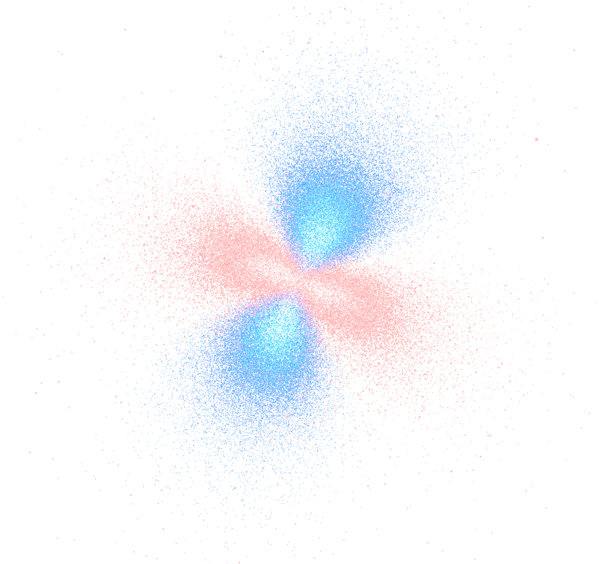

<h1 align="center">Electron Orbital Visualiser</h1>

  

Interactive, high‑performance visualiser for hydrogen‑like electron orbitals. Implements normalized hydrogenic radial functions and real spherical harmonics (up to d; math extended for f), multiple render modes (CPU Points, GPU/WebGL, WebGPU), smooth camera snapping, HDR tone mapping, and an orientation gizmo.

## Highlights
- Physically motivated math: normalized hydrogenic radial Rnl(r) with associated Laguerre recurrence, and real normalized Ylm(θ,φ) via associated Legendre (supports l ≤ 3 in code).
- Four render paths:
  - Instanced: InstancedMesh spheres or billboard impostors.
  - Points: single BufferGeometry with importance sampling (fast CPU).
  - GPU (WebGL): render‑to‑texture sampling + shader point cloud.
  - WebGPU: compute shader sampling + render shader (Chrome/Edge).
- Importance sampling: inverse CDF tables for |R|² r² and |Y|² sinθ; no rejection loops in Points mode.
- Smooth X/Y/Z snaps with easing; orientation axes overlay (bottom‑left).
- HDR/tone mapping toggle (ACES fit + sRGB), optional environment map.
- Zoom‑aware point brightness so clouds stay legible when zooming.

## Requirements
- Modern browser with WebGL2. GPU (WebGL) mode needs float color buffer support: `EXT_color_buffer_float` or `WEBGL_color_buffer_float`.
- WebGPU mode: Chrome/Edge with WebGPU enabled (Chrome 113+). Falls back automatically if unavailable.

## Quick Start
1. Serve the folder locally (recommended to avoid file URL issues):
   - Python 3: `python3 -m http.server 8000`
   - Node: `npx http-server -c-1`
2. Open `http://localhost:8000/index.html`.

Opening `index.html` directly from disk also works for most features, but some GPU paths may be limited by browser security.

## UI & Controls
- Right panel: orbital presets (1s, 2s/3s/4s; 2p/3p/4p; 3d/4d variants).
- Bottom panel controls:
  - Density: number of points (performance/quality).
  - Adaptive: incremental updates vs full refresh.
  - Mode: Instanced → Points → GPU (WebGL) → WebGPU.
  - HDR: toggles tone mapping (ACES) on/off.
  - Cull: toggle depth testing/writing for point clouds.
  - Pause, Clear, Save PNG.
- Orientation overlay (bottom‑left): mini axes + buttons X/Y/Z/Reset with smooth transitions.
- Mouse: drag to orbit, wheel to zoom.

## Rendering Modes
- Points (CPU):
  - One BufferGeometry; positions and per‑point ψ updated each refresh.
  - Size/alpha modulated by |ψ|; zoom‑aware alpha for clarity.
- GPU (WebGL):
  - Renders samples into an RGBA32F target; point shader reads (x,y,z,ψ).
  - Requires WebGL2 + float render targets.
- WebGPU:
  - Compute pass samples via inverse CDFs; vertex scales points by |ψ| and zoom; fragment does optional ACES + sRGB.

## Accuracy Notes
- Radial functions use normalized hydrogenic forms in atomic units, computed via a stable Laguerre recurrence.
- Real spherical harmonics are normalized; sampling tables use |Y|² sinθ and |R|² r² to draw from |ψ|² directly.

## Tuning
- Point size: edit defaults in `index.html` (search `uPointSize` and `webgpu.uniforms.pointSize`).
- Brightness: adjust `uBrightnessGamma` (points/GPU shaders) or the ACES toggle (HDR button). Exposure can be added easily if needed.
- Performance: lower Density, use Points or GPU mode; WebGPU is fastest if available.

## Troubleshooting
- “GPU mode fell back to Points”: your GPU/driver likely lacks float color buffer support; use Points/WebGPU.
- WebGPU unavailable: ensure your browser version supports WebGPU and it’s enabled; the app will fall back to other modes.
- Tailwind CDN error: the app pins Tailwind Play CDN to a stable version to avoid runtime issues.

## License
See [LICENSE](LICENSE).
